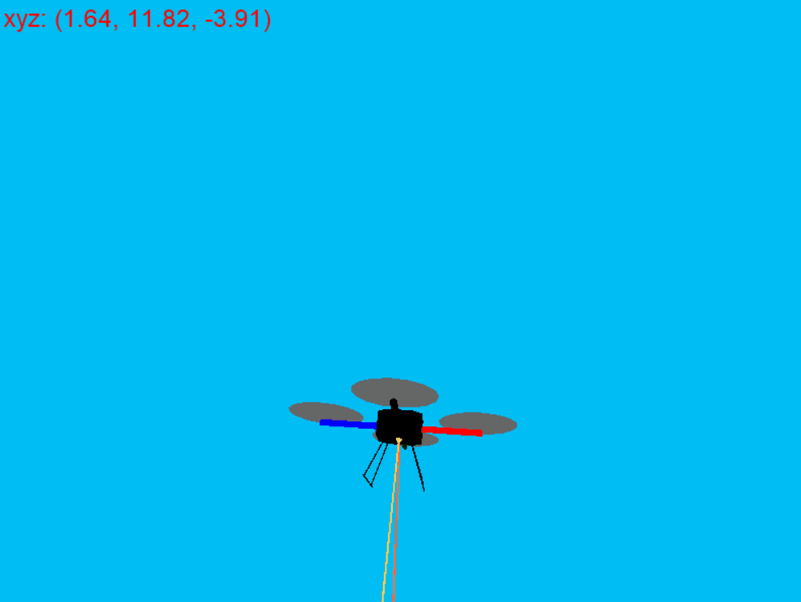
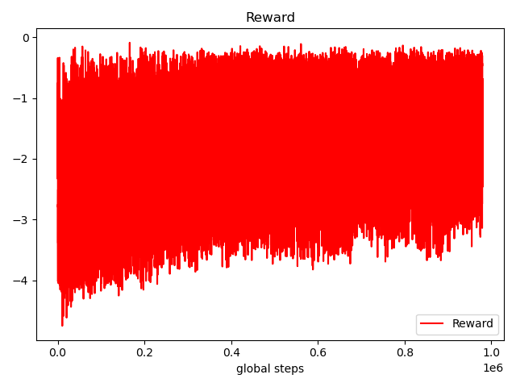

# Quadrotor_VelocityControl_DDPG
Using PARL to solve the velocity control task of quadrotor by DDPG. The environment is created by RLSchool,
and the DDPG is imported from PARL, which is the Reinforce Learning repository developed by PaddlePaddle group of Baidu.

# First Edition

I just used the settings for hovering-control task to fit this velocity-control task.
One thing to be noted is that the activation function of Critic should be None.
For hidden layers, tanh seems like a better activation than relu in reinforce learning.
The result seems not good. Test reward converged to about -20 after training for 1M steps.


As described by README.md of [RLSchool/quadrotor](https://github.com/PaddlePaddle/RLSchool/tree/master/rlschool/quadrotor), "Yellow arrow is the expected velocity vector;
orange arrow is the real velocity vector." So in the good result, the yellow vector and orange vector 
should be as similar as possible. 
But my drone just tends to fall down slowly and the two arrows are not similar at all! 

# Second Edition
There must be something wrong I think. I don't understand how the reward is measured. 
Maybe some extra work on the features could be done, for example, we can add the difference between 
next real velocity and next expected velocity to the reward.
It should be noted that the real velocity is given in local (body) coordinate while the next 
expected velocity is given in global (reference) coordinate. So before add the expected velocity 
into the input features, i.e. the obs, we should first conduct a coordinate transform.

We can get the rotation matrix by this.
```python
def get_rotation_matrix(yaw, pitch, roll):
    m_yaw = np.array([[math.cos(yaw), -math.sin(yaw), 0],
                       [math.sin(yaw), math.cos(yaw), 0],
                       [0, 0, 1]], dtype="float32")
    m_pitch = np.array([[math.cos(pitch), 0, math.sin(pitch)],
                        [0, 1, 0],
                        [-math.sin(pitch), 0, math.cos(pitch)]], dtype="float32")
    m_roll = np.array([[1, 0, 0],
                       [0, math.cos(roll), -math.sin(roll)],
                       [0, math.sin(roll), math.cos(roll)]], dtype="float32")
    r_matrix = np.matmul(m_roll, np.matmul(m_pitch, m_yaw))

    return r_matrix
```
Then by ```np.matmul(r_matrix, velocity_in_global)```, we can get the expected next velocity in local coordinate.

On the first hand, I added the above local expected velocity into the obs, On the other hand, 
I added the inner product between next velocity and next expected velocity (both in local coordinate) into the reward, as ''v_diff'.
I hope this additional reward could lead the model to fit the controlling of velocity. By the way, the scale is much different
 between real reward and v_diff, so I multiplied a scale-factor (0.01) to the v_diff.


But again, my drone just can't learn to fit the expected velocity. ╮(╯﹏╰）╭

# Third Edition
I run to read the source code of RLSchool and try to find the computation of the reward. It turns out to be very simple.
```python
def _get_reward():
    reward = - min(self.dt * self.simulator.power, self.healthy_reward)
    ...
    elif self.task == 'velocity_control':
        task_reward = -0.001 * self._get_velocity_diff(velocity_target)
        reward += task_reward
    ...
    return reward

def _get_velocity_diff(self, velocity_target):
    vt_x, vt_y, vt_z = velocity_target
    diff = abs(vt_x - self.state['b_v_x']) + \
        abs(vt_y - self.state['b_v_y']) + \
        abs(vt_z - self.state['b_v_z'])
    return diff
```
The reward consists of three parts: the energy cost, healthy_reward and the velocity difference computed by Manhattan Distance.
The scale factor of v_diff they use is 0.001, maybe too small I think.

Another important thing is that **the next expected velocity is actually in the local coordinate according to the code**!
This is so frustrating, and I think I need to **open an issue there**. In this edition, I plan to update the v_diff 
by treating the next expected velocity as in the local coordinate.

# New Discoveries
After debugging for a whole day, I found some possible bugs in the RLSchool source code as described [here](https://github.com/PaddlePaddle/RLSchool/issues/30).

The ideal result is like this.


Here I just used the sampled action list to get target velocity list as input actions.

# Final trial
After modifying the target velocity's coordinate and the factor for velocity difference in reward calculation to 0.1,
I put the converted next expected velocity in body coordinate into the obs and start to train again. Note that I copied the
env.py and quadrotorsim.py from RLSchool source code into my project for convenient debugging. Also Note that I used
`r_matrix = env.simulator.get_coordination_converter_to_body()` to get precise rotation matrix.

The evaluate reward converged to about 1280 after 1M steps. It behaves like this.


Now at least the orange arrow is "trying" to fit with the yellow arrow! The reward **per step during training** is recorded.


# review and summary
The reason why we converge to about -20 at the beginning is due to the small factor for velocity difference penalty. 
Then the drone learn to save its energy by setting four voltage to minial value (0.1), which corresponds to -0.002 energy penalty 
and the drone just falls down,
and at the same time the velocity difference penalty ranges from about -0.03 to 0 with the factor 0.001. Then after 1000 steps, 
the total reward is about -20, because the velocity difference is big most of the time.

Finally I reset the factor to 0.1, resulting the velocity difference in a general range(-4, 0), which is the dominate penalty, 
and will lead the drone to learn **velocity control** correctly.
In this case, the ideal condition is that the velocity differences are all 0 throughout the 1000 steps, resulting the 
velocity difference penalty to be 0. Then about energy penalty, it ranges from -0.002 to -42.53
 (corresponding to voltage of 0.1 and 15, respectively).
Many of them are smaller than health penalty -1, and will be covered by it. So the final ideal reward per step will be
many -1 and sometimes bigger than -1. After 1000 steps, the ideal total reward will be a number bigger than -1000. 
My final result converged to about -1280,
which is not so bad. Maybe I can fine tune it or even design a better model to get a better result in the future.

# measurement of velocity difference
I think the inner product of two vectors is better than manhattan distance as the measurement of VD. First, inner product is differentiable, 
which is more mathematically elegant. Second, manhattan distance is unstable. Assume that we have two vectors
 **a** and **b** both with length 1 in a X-o-Y 2D coordinate. If they have exact opposite directions, the inner product will always be -1, while 
 the manhattan distance will change along with the specific direction of them. Third, manhattan distance is sometimes unreasonable. Again with the
 two vectors **a** and **b**, assume a is upward (north), b is right-bottom directed (southeast), the manhattan distance is $1+\sqrt{2} \approx 2.414$, 
 which is even bigger than 2, which is the MD when b is downward! 

# how to play
First install the packages required. `pip install -r requirements.txt`

Using `python3 train.py` to train from scratch.

Uncomment the `agent.restore('model_dir/best.ckpt')` in train.py to continue to train.

Using `python3 test.py` to evaluate.